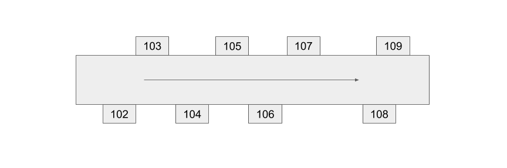
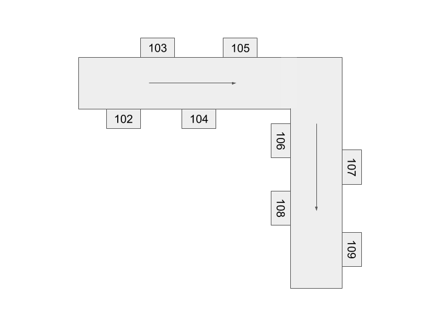

# room-finder

## Installation

### With `npm` or `yarn`

You can use `npm` or `yarn` to install `room-finder` for use on either the frontend or on the backend with Node.

```bash
yarn add room-finder
# OR
npm install room-finder
```

#### Importing with Node or CommonJS

```js
const { Building, Hallway, Room, Turn, Direction } = require("room-finder");

console.log(
  new Building([
    new Hallway([
      new Room("A", Direction.LEFT),
      new Room("B", Direction.RIGHT),
      new Turn(Direction.RIGHT),
      new Room("C", Direction.LEFT),
    ]),
  ]).getDirections("A", "C")
);
```

#### ES6 Imports (Recommended)

```js
import { Building, Hallway, Room, Turn, Direction } from "room-finder";

console.log(
  new Building([
    new Hallway([
      new Room("A", Direction.LEFT),
      new Room("B", Direction.RIGHT),
      new Turn(Direction.RIGHT),
      new Room("C", Direction.LEFT),
    ]),
  ]).getDirections("A", "C")
);
```

#### TypeScript

You can use the same same ES6 import syntax as above when using TypeScript. `room-finder` is written with TypeScript and ships with type definition files.

#### RequireJS (AMD)

```js
requirejs(["room-finder"], function(RoomFinder) {
  console.log(
    new RoomFinder.Building([
      new RoomFinder.Hallway([
        new RoomFinder.Room("A", RoomFinder.Direction.LEFT),
        new RoomFinder.Room("B", RoomFinder.Direction.RIGHT),
        new RoomFinder.Turn(RoomFinder.Direction.RIGHT),
        new RoomFinder.Room("C", RoomFinder.Direction.LEFT),
      ]),
    ]).getDirections("A", "C")
  );
});
```

### With `<script>` tag from CDN

You can also directly include `room-finder` with a `<script>` tag by either [downloading index.min.js](https://unpkg.com/room-finder) or using a CDN like [unpkg](https://unpkg.com/room-finder) or [jsDelivr](https://cdn.jsdelivr.net/npm/room-finder/dist/).

`RoomFinder` will be included as a global variable.

```html
<script src="https://unpkg.com/room-finder@0.0.4"></script>
<!-- OR with jsDelivr: -->
<!-- <script src="https://cdn.jsdelivr.net/npm/room-finder@0.0.4/dist/index.min.js"></script> -->
<script>
  console.log(
    new RoomFinder.Building([
      new RoomFinder.Hallway([
        new RoomFinder.Room("A", RoomFinder.Direction.LEFT),
        new RoomFinder.Room("B", RoomFinder.Direction.RIGHT),
        new RoomFinder.Turn(RoomFinder.Direction.RIGHT),
        new RoomFinder.Room("C", RoomFinder.Direction.LEFT),
      ]),
    ]).getDirections("A", "C")
  );
</script>
```

The version number in the URL isn't required, but it's recommended so that breaking changes in the package don't break your app.

## Usage

### Modeling a simple Hallway



```js
// examples/ex1.ts#L3-L1000

// A Hallway has an array of Rooms. Each Room has a name and a side.
const hallway = new Hallway([
  new Room("102", Direction.RIGHT),
  new Room("103", Direction.LEFT),
  new Room("104", Direction.RIGHT),
  new Room("105", Direction.LEFT),
  new Room("106", Direction.RIGHT),
  // If you don't specify a side, the default is Direction.LEFT
  new Room("107"),
  new Room("108", Direction.RIGHT),
  new Room("109", Direction.LEFT),
]);

// A Building has an array of Hallways.
// In this case, there's only one Hallway in the Building.
const building = new Building([hallway]);

console.log(building.getDirections("102", "109"));
// Turn right out of room 102
// Continue, then turn left into room 109

console.log(building.getDirections("107", "103"));
// Turn right out of room 107
// Continue, then turn right into room 103
```

### Adding a Turn



```js
// examples/ex2.ts#L3-L1000

const hallway = new Hallway([
  new Room("102", Direction.RIGHT),
  new Room("103", Direction.LEFT),
  new Room("104", Direction.RIGHT),
  new Room("105", Direction.LEFT),
  new Turn(Direction.RIGHT),
  new Room("106", Direction.RIGHT),
  new Room("107"),
  new Room("108", Direction.RIGHT),
  new Room("109", Direction.LEFT),
]);

const building = new Building([hallway]);

console.log(building.getDirections("102", "109"));
// Turn right out of room 102
// Continue, then turn right (after passing room 105 on your left)
// Continue, then turn left into room 109

console.log(building.getDirections("107", "103"));
// Turn right out of room 107
// Continue, then turn left (after passing room 106 on your left)
// Continue, then turn right into room 103
```
