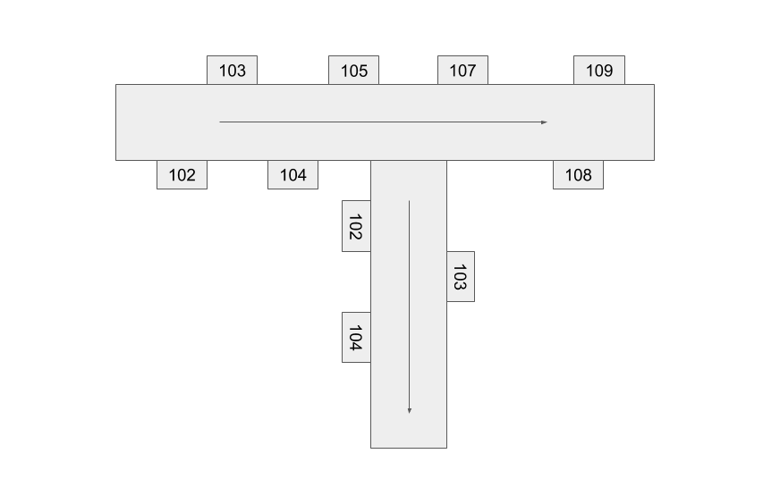

# room-finder

## The Problem

The Walnut Hills Programming Club created this package while developing [Walnut.Direct](https://www.walnut.direct/), a web app to give students, parents, and visitors directions between rooms in Walnut Hills High School. For every possible pair of rooms in the school, we wanted to provide a set of clear, specific directions, and we didn't want to use GPS or sensors, since this would pose problems with both cost and location accuracy.

Since we have too many rooms in our school to write every set of directions by hand, we needed a way to model our school so that we could generate directions from any room to any other room. Our solution was to model a building as a list of hallways, as well as a set of connections between hallways. After converting the hallways and connections into a graph data structure, we could apply Dijkstra's algorithm to find a path between any two nodes in the building.

Using our JavaScript/TypeScript library, room-finder, you can apply our method to any other building. After you specify the hallways and connections, room-finder will automatically generate the graph, use Dijkstra's algorithm, and output a set of readable directions from any room to any other room. Our goal is to make room-finder a simple way for anyone with some JavaScript experience to intuitively create a model for a building without having to measure distances or install sensors to generate directions.

We have tried to make our package very flexible. We support rooms with multiple names (aliases). You can modify edge lengths in the graph if room-finder's default route is too long. By extending our default classes, you can create hallways and rooms that output custom directions.

If you have problems, feedback, or suggestions, please tell us by [creating an issue in GitHub](https://github.com/walnutprogramming/room-finder/issues). Pull requests are welcome.

The full documentation is at [room-finder.walnut.direct](https://room-finder.walnut.direct/).

## Installation and Getting Started

You can use our library on a server or on any device that can run Node, but if you're creating a web app like [ours](https://github.com/WalnutProgramming/Directions), generating the model and directions on the frontend is unlikely to be a problem for performance.

### With NPM or Yarn

You can use NPM or Yarn to install `room-finder` for use on either the frontend or on the backend with Node.

```bash
yarn add room-finder
# OR
npm install room-finder
```

#### Importing with Node or CommonJS

```js
const { Building, Hallway, Room, Turn, Direction } = require("room-finder");

console.log(
  new Building([
    new Hallway([
      new Room("A", Direction.LEFT),
      new Room("B", Direction.RIGHT),
      new Turn(Direction.RIGHT),
      new Room("C", Direction.LEFT),
    ]),
  ]).getDirections("A", "C")
);
```

#### ES6 Imports (Recommended)

```js
import { Building, Hallway, Room, Turn, Direction } from "room-finder";

console.log(
  new Building([
    new Hallway([
      new Room("A", Direction.LEFT),
      new Room("B", Direction.RIGHT),
      new Turn(Direction.RIGHT),
      new Room("C", Direction.LEFT),
    ]),
  ]).getDirections("A", "C")
);
```

#### TypeScript

You can use the same same ES6 import syntax as above when using TypeScript. `room-finder` is written with TypeScript and ships with type definition files.

#### RequireJS (AMD)

```js
requirejs(["room-finder"], function(RoomFinder) {
  console.log(
    new RoomFinder.Building([
      new RoomFinder.Hallway([
        new RoomFinder.Room("A", RoomFinder.Direction.LEFT),
        new RoomFinder.Room("B", RoomFinder.Direction.RIGHT),
        new RoomFinder.Turn(RoomFinder.Direction.RIGHT),
        new RoomFinder.Room("C", RoomFinder.Direction.LEFT),
      ]),
    ]).getDirections("A", "C")
  );
});
```

### With `<script>` tag from CDN

You can also directly include `room-finder` with a `<script>` tag by either [downloading index.min.js](https://unpkg.com/room-finder) or using a CDN like [unpkg](https://unpkg.com/room-finder) or [jsDelivr](https://cdn.jsdelivr.net/npm/room-finder/dist/).

`RoomFinder` will be included as a global variable.

```html
<script src="https://unpkg.com/room-finder"></script>
<!-- OR with jsDelivr: -->
<!-- <script src="https://cdn.jsdelivr.net/npm/room-finder/dist/index.min.js"></script> -->
<!-- We highly recommend that you specify the version of room-number you want by 
replacing "room-finder" with "room-finder@x.y.z" in either URL above. -->
<script>
  console.log(
    new RoomFinder.Building([
      new RoomFinder.Hallway([
        new RoomFinder.Room("A", RoomFinder.Direction.LEFT),
        new RoomFinder.Room("B", RoomFinder.Direction.RIGHT),
        new RoomFinder.Turn(RoomFinder.Direction.RIGHT),
        new RoomFinder.Room("C", RoomFinder.Direction.LEFT),
      ]),
    ]).getDirections("A", "C")
  );
</script>
```

The version number in the URL isn't required, but it's recommended so that breaking changes in the package don't break your app.

## Modeling a simple Hallway


This is a simple example of a small "Building." Let's see the code we would need to model this Building so that we can generate directions between any pair of rooms.

The example building above includes only a single hallway with 8 rooms. In this example, we will arbitrarily decide to list the rooms starting from the left side of the picture. (That's what the arrow in the picture represents.)

To create the model, imagine walking down the hallway in the picture from left to right.

- You would pass 102 on your RIGHT,
- then pass 103 on your LEFT,
- then pass 104 on your RIGHT,
- then pass 105 on your LEFT.
- then pass 106 on your RIGHT,
- then pass 107 on your LEFT,
- then pass 108 on your RIGHT,
- then pass 109 on your LEFT.

If we reversed it and started from the right, we would need to flip the side that each room is on, but the generated directions would stay the same.

```js
// examples/basic.ts#L1-L1000

import {
  Building,
  Hallway,
  Room,
  Direction,
  assertValidBuilding,
} from "room-finder";

/* 1. MODEL THE BUILDING */
// A Hallway has an array of Rooms. Each Room has a name and a side.
const hallway = new Hallway([
  new Room("102", Direction.RIGHT),
  new Room("103", Direction.LEFT),
  new Room("104", Direction.RIGHT),
  new Room("105", Direction.LEFT),
  new Room("106", Direction.RIGHT),
  // If you don't specify a side, the default is Direction.LEFT
  new Room("107"),
  new Room("108", Direction.RIGHT),
  new Room("109", Direction.LEFT),
]);

// A Building has an array of Hallways. In this case, there's only one Hallway in the Building.
const building = new Building([hallway]);

/* 2. CHECK BUILDING VALIDITY */
// The assertValidBuilding function throws an error
// if there is a problem with the generated Building.
assertValidBuilding(building);

/* 3. GENERATE DIRECTIONS BETWEEN ROOMS */
console.log(building.getDirections("102", "109"));
// output:
//   Turn right out of room 102
//   Continue, then turn left into room 109

console.log(building.getDirections("107", "103"));
// output:
//   Turn right out of room 107
//   Continue, then turn right into room 103
```

## Adding a Turn



This example is the same as above, but a Turn is inserted between 105 and 106. Again, we decided to start the hallway from the left in the picture. Imagine walking through this hallway:

- You would pass 102 on your RIGHT,
- then pass 103 on your LEFT,
- then pass 104 on your RIGHT,
- then pass 105 on your LEFT,
- **then turn RIGHT,**
- then pass 106 on your RIGHT,
- then pass 107 on your LEFT,
- then pass 108 on your RIGHT,
- then pass 109 on your LEFT.

Let's convert that into a room-finder model:

```js
// examples/turn.ts#L1-L1000

import {
  Building,
  Hallway,
  Room,
  Direction,
  Turn,
  assertValidBuilding,
} from "room-finder";

const building = new Building([
  new Hallway([
    new Room("102", Direction.RIGHT),
    new Room("103", Direction.LEFT),
    new Room("104", Direction.RIGHT),
    new Room("105", Direction.LEFT),
    // All we have to do is add a Turn in the middle of the Hallway.
    new Turn(Direction.RIGHT),
    new Room("106", Direction.RIGHT),
    new Room("107"),
    new Room("108", Direction.RIGHT),
    new Room("109", Direction.LEFT),
  ]),
]);

assertValidBuilding(building);

console.log(building.getDirections("102", "109"));
// Turn right out of room 102
// Continue, then turn right (after passing room 105 on your left)
// Continue, then turn left into room 109

console.log(building.getDirections("107", "103"));
// Turn right out of room 107
// Continue, then turn left (after passing room 106 on your left)
// Continue, then turn right into room 103
```

## FRONT

## Adding a Fork


Since a person walking through the top hallway in this example has a choice about whether to turn right into the second hallway or to continue in the same hallway, we need to model this example as **two separate Hallways connected by a Fork**.
